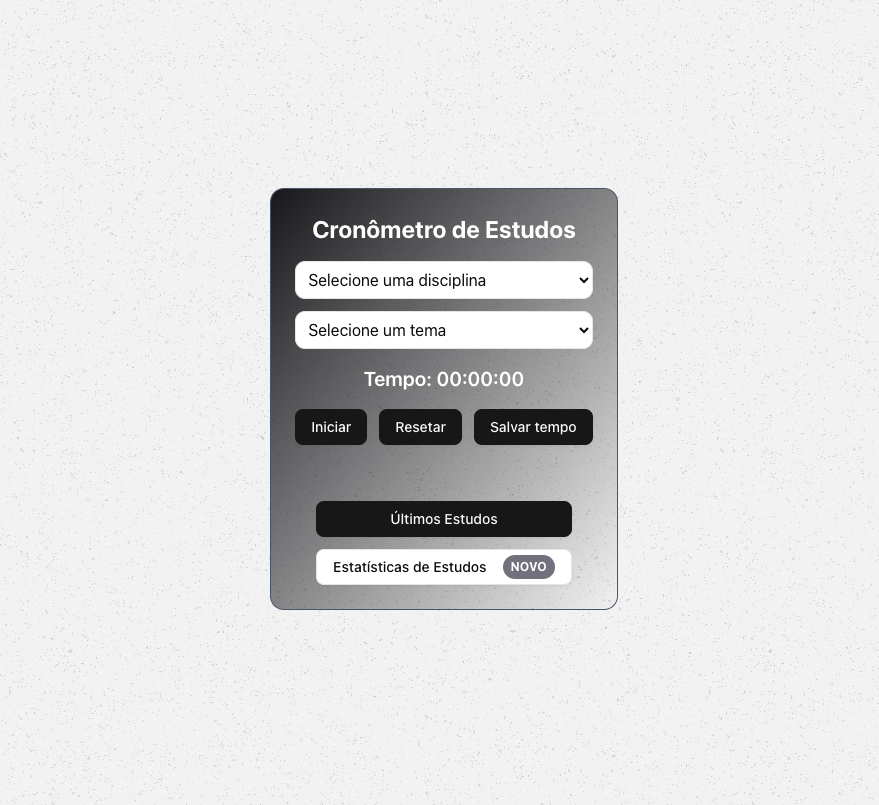

# Study Timer - Estatísticas de Estudos

O Study Timer é uma aplicação desenvolvida em React e Next.js que permite aos usuários monitorar o tempo de estudo de diferentes disciplinas e tópicos. A ferramenta auxilia no gerenciamento do tempo de estudo, salvando os registros no localStorage e exibindo estatísticas visuais. Este projeto é um teste técnico para a vaga de Desenvolvedor Frontend NextJs na [Vício de uma estudante](https://viciodeumaestudante.com.br/).

## Funcionalidades

- Selecionar uma disciplina e um tópico de estudo.

- Iniciar, pausar e resetar um cronômetro para monitorar o tempo de estudo.

- Salvar os tempos de estudo para futura consulta.

- Visualizar histórico de estudos.

- Exibir estatísticas com gráficos.

## Tecnologias Utilizadas

- React e Next.js para desenvolvimento da interface.

- Tailwind CSS para estilização.

- ShadCN/UI para componentes reutilizáveis.

- Recharts para visualização de dados.

- LocalStorage para persistência dos dados do usuário.

## Como Executar o Projeto

Clone o repositório:

```bash
git clone https://github.com/seu-usuario/study-timer.git
```

Acesse o diretório do projeto:

```bash
cd study-timer
```

Instale as dependências:

```bash
npm install
# or
yarn install
```

Inicie o servidor de desenvolvimento:

```bash
npm run dev
# or
yarn dev
```

Acesse no navegador:

http://localhost:3000

## Melhorias Futuras

- Adicionar suporte a contas de usuário e login.

- Permitir exportação dos registros de estudo.

- Integração com calendários para planejamento.
